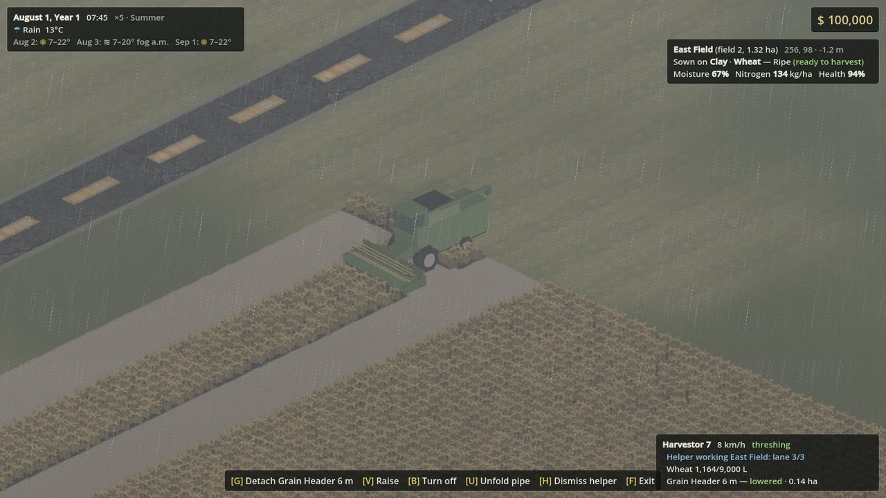
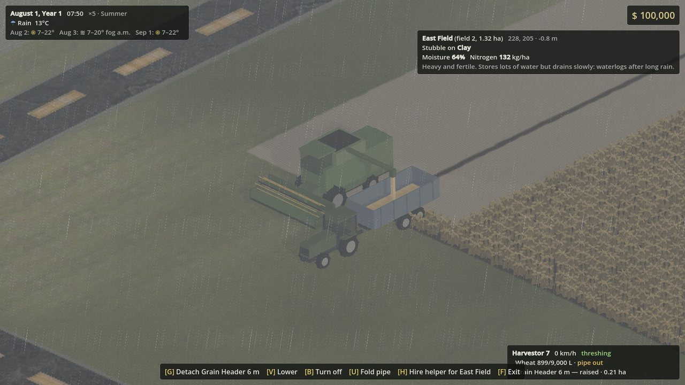
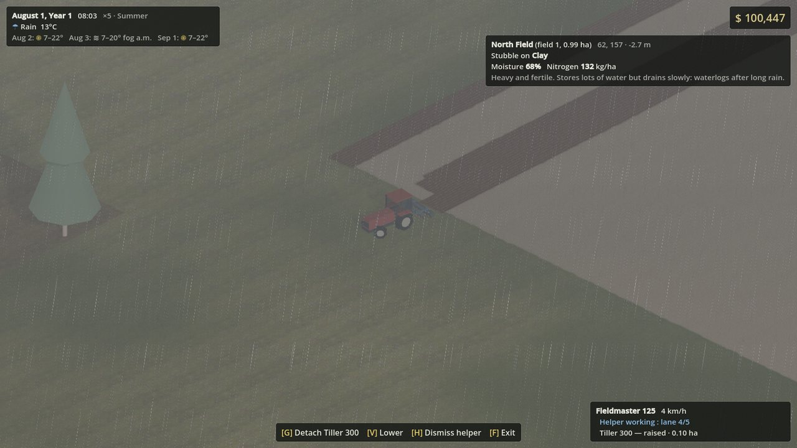
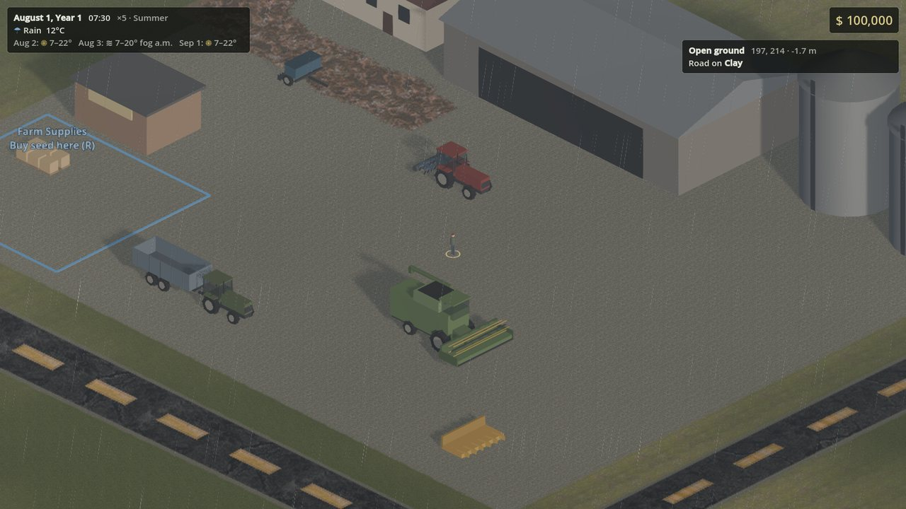
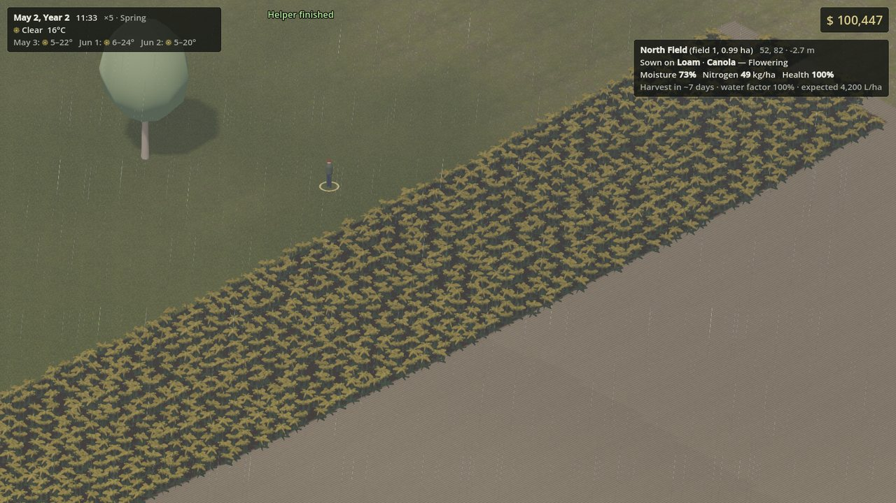

# Headland

A top-down farming simulation: the machines and field work of *Farming Simulator*, with the systemic depth of
*Dwarf Fortress* and *Cataclysm: DDA* (soils, weather, crop agronomy), seen through an isometric camera.
Built with **Godot 4.7** and **C#**.

> **Status:** early prototype. The core farming loop is playable; machines, buildings and the farmer are simple
> generated models for now.



| | |
|---|---|
|  |  |
|  |  |

## What's in it

- **The farming loop.** Cultivate or plow the stubble, sow in season, fertilize the growing crop and spray the weeds
  before they cost it yield, harvest it with the right header, unload the combine into a trailer and tip the grain at
  the elevator. Meadows are mown when the grass is ready, and it grows back for the next cut.
- **Hay, straw and bales.** Mown grass lies in a windrow, and the combine leaves the straw of wheat and barley in a
  swath behind it. Bale the grass as it is, or ted it first: the tedder spreads it and turns it into hay, worth more,
  which the rake gathers back into a windrow. The round baler drops a 4,000 L bale behind it each time its chamber is
  full, the bale collector picks the bales up beside it and sets them down where you stop, and the dairy buys those
  left in its bale area. Tilling works what lies cut into the ground.
- **Front loader tools.** The loader arm's tool carrier takes a bale spike or a pallet fork: lower it to a bale's
  middle or under a pallet, drive in, and it takes it, lifted and tilted with the arm; set it down anywhere, on top of
  another to stack bales. The farm's grain mill turns the wheat tipped into its pit into flour, which comes out on
  pallets beside it every hour, and the farm shop buys the pallets left beside its store.
- **Machines.** Tractors, a combine with swappable grain and corn headers, a tipping trailer, a cultivator, a plow, a
  trailed seed drill, a fertilizer spreader, a trailed sprayer whose boom folds for the road, a mower, a tedder, a rake,
  a round baler, a bale collector, a front loader with a bale spike and a pallet fork, most with
  options as in a dealer's catalog: dual wheels or tracks, a front linkage, a front weight or loader consoles, beacons,
  a stronger engine, a bigger tank or bed, a wider cultivator or drill, the color. The menu's shop lists them by
  category and brand, each turning in a preview with what it is (power, capacity, working width, the power it needs…)
  and its options, the price following the options picked. Bought, or leased for 2% of the price and 2.1% for each
  hour it runs (its engine on, or hitched to one that is), a machine waits on the machinery dealer's lot.
  Steering is kinematic, trailers articulate, mounted implements lift on the three-point hitch, and working speed
  depends on the implement, the engine's power, the load, the slope and the ground: wheels sink and slip in wet fields,
  less on duals or tracks. Engines burn fuel by the power they deliver, and stop when the tank runs dry. Machines wear
  as they drive and work, faster on a field and much faster working: a worn engine is weaker and thirstier, a worn
  implement slower and more wasteful of what it spreads, until the workshop repairs it (1% of its price for all its
  wear). Their paint dulls as they drive, until the workshop repaints it, and they get muddy, the more so on wet fields
  and working, until the rain rinses them or a wash bay cleans them. The menu's garage lists the farm's machines
  with their condition, paint, fuel, operating hours, age, where they are and what they're worth (less as they age,
  run and wear), to sell them back to the dealer, give a leased one back, or have them repaired, repainted or given
  other options where they stand: a mechanic comes out for 20% more.
- **Places to trade and service.** Tip grain at the elevator, or at the flour mill, which pays more but only takes
  what it can mill. Keep grain in the farm silo and load it back into a trailer later, buy seed, fertilizer and
  herbicide at the farm shop, refuel and wash at the gas station, or at the farm's own fuel tank, filled by ordering
  diesel in bulk (5,000 L at a time, for less, on foot at its pump), mill the farm's wheat into flour at its grain mill,
  get machines repaired or their options changed at the
  workshop (new options cost what they cost more than the old ones, and the work), leave bales of grass, hay or straw
  at the dairy, and pick up the machines bought or leased at the shop, or leased for contracts, at the machinery
  dealer.
  Prices follow the season, drop as you flood a buyer and recover over time, and now and then a buyer pays more for a
  few days. Each place is a point of interest defined in JSON and built from components, as Farming Simulator builds
  its placeables: selling and buying stations, silos, production points that run by the hour, workshops, washing
  stations and delivery spots, each with the area where machines use it and its opening hours.
- **Finances.** Every sale and purchase goes into the farm's books under its category: sales, purchases, fuel,
  maintenance, machines, production costs, wages, leasing, land, loan interest, contracts. The menu's finances show them day
  by day or month by month, and are where the farm borrows from the bank: $5,000 at a time up to $500,000, at 5% a year charged every day. Interest, wages and
  running costs can overdraw the account; until the balance is back above zero, nothing can be bought and no helper
  hired.
- **Difficulty.** Easy, normal and hard set the money and loan the farm starts with, and how much everything it
  buys costs, from seed to machines, land and wages; sale prices stay the same.
- **Farmland.** The map is cut into parcels that are bought whole, with the fields in them, from the neighbors who own
  them: on the map's farmland layer, click a parcel to see its area, fields, owner and price ($20,000 a hectare), and
  buy it there. Parcels go by the fields in them ("Field 4 land"), as fields alone have numbers; land sells back for what it cost, except the ground the farm's own buildings stand on. Machines only work the farm's own land, and the neighbors'
  fields it has a contract on.
- **Contracts.** Every morning the neighbors post the work their fields need in the season (cultivating or plowing
  stubble, sowing a seedbed, fertilizing a growing crop, spraying weeds, harvesting a ripe crop, mowing or baling a
  meadow), and
  buyers order goods for more than the market price. The menu's contracts are the board: take up to three at a time,
  each due within a few days. A field job is done once 95% of the field is; a harvest's crop is the neighbor's, and
  90% of it must be tipped at the buyer named on the contract, who takes it without paying, as the grass of a bale
  job must be left there in bales. Giving a contract back, or
  finishing late, costs 10% of its reward. A field job can also be taken with leased machines, for a fee taken from
  the reward: they wait on the machinery dealer's lot, implements hitched, and go back when the contract ends. Fields
  under contract show it on their sign and get an outline. The jobs are JSON too (`game/data/contracts/`).
- **Field helpers.** Press H and a helper works the field one lane after the other, leaving out what's done already,
  so you can hand over a half-worked field. Lined up on a lane, it goes on from where you are. On the headland it
  backs up to turn onto the next lane with a mounted implement or a header, loops round with a trailed one, and it
  lifts the implement whenever it leaves the field. Helpers earn $150 per hour of work, whatever the clock speed. Each
  has a number, the lowest free when hired, on its vehicle on the map and the minimap.
- **Soils and crops.** Every 0.5 m cell tracks soil type, moisture, nitrogen, crop stage and health, weeds, and
  whether it was fertilized. Crops grow by growing degree-days; winter wheat and canola need a winter (vernalization)
  before they shoot; drought, waterlogging, frost and nitrogen shortage cost health and yield. Weeds come up on tilled
  ground and among the crops in the growing season and cost up to a fifth of the yield (corn more): a cultivator kills
  them while they're small, the plow buries them all, and herbicide kills them and keeps new ones out until the next
  tillage or harvest. Fertilizer gives the soil the nitrogen the crops take from it; grass, cut several times a year,
  needs it after each cut. On a compressed calendar (three days per month)
  crops still ripen in their real months.
- **Weather.** A seeded climate model with a three-day forecast, rain, storms, snow, fog, wet ground, snow cover,
  drifting cloud shadows, and a sun that follows the time of day and the season.
- **Inspect anything.** Hover the ground to read its soil, moisture, nitrogen, weeds, crop stage, vernalization progress
  and a harvest estimate.
- **Prices, statistics and helpers.** The menu's prices list what each buyer pays now for everything sold on the map,
  the best first with what the farm has in stock and where the market goes next month; for the goods picked, each
  buyer's price and how it takes them, and the market month by month through the year. Its statistics are the farm's
  records (days, money in and out, land, machines, contracts, bales, the hectares worked by kind of work, what it
  harvested, sold and bought) and how each of its fields is doing: crop, growth, weeds, fertilizing and what the crop
  would yield now. Its helpers list the helpers at work, with their vehicle, field, lanes, time and wages, to dismiss
  one or take a seat beside it.
- **Map.** The menu's map (M) shows the world from above with the numbered fields, the farmland (yours shaded), the
  contracts' fields, the places to sell, buy and get service, the machines (white dots, the helpers' blue ones with
  their numbers) and you, each switched on and off; its
  layers color the fields by crop, growth (plowed, cultivated, sown, growing, ready, withered, harvested), soil and
  moisture, and the parcels by owner (where land is bought). A click sets a waypoint, a flag on the map, until you get
  there. The minimap in the corner (Shift+M: small, large or off) shows what's around you, turned as the camera looks,
  the waypoint held at its edge.
- **HUD.** Laid out as in Farming Simulator: the keys that do something now down the top left, the date, the weather,
  the money and the forecast top right with the contracts under way and the inspector under them, the minimap bottom
  left, and bottom right the vehicle you drive and what it pulls, each with its gauges (speed, engine load, fuel, fill
  levels, bales, condition, dirt) and its states (lowered, turned on, threshing, pipe out, the seed it sows, a helper at
  work), as its parts report them, and what keeps it from working.
- **Saves.** F5 quicksaves, F8 quickloads, and the game autosaves every 10 minutes. A save is a zip in Godot's
  user data folder (`saves/`): readable JSON for everything on the map, plus the compressed field layers.
- **Data-driven.** Crops, machines, buildings and other points of interest, bales, soils, the climate, the map, the money
  rules, the kinds of hitches and lamps and the shop's brands and categories are JSON files in [`game/data`](game/data). Machines are built from components (running gear, motor, hitches,
  tanks, work areas, pipe, tipper, lights, crane arm…), so a new machine is a combination of them; POIs are built the
  same way, sharing the kinds that make sense on both (lamps lit at night or as someone comes by, moving parts,
  storage, map icons), and so are the objects lying about, such as bales. [`docs/COMPONENTS.md`](docs/COMPONENTS.md)
  lists every setting of machines, POIs, objects and components.

## Controls

Keys follow their position on the keyboard, so AZERTY players get ZQSD for movement. The list at the top left shows the keys
that do something where you are, in the words of the tool they work ("Lower cultivator", "Unfold boom", "Pipe out"), and
F1 lists every key for walking or for the vehicle you drive. Esc opens the menu
(the map and the farmland, prices, contracts, finances, statistics, helpers, the shop, the garage, every key, save and load), or closes the screen on top. A gamepad works too (left stick
to walk and drive, A lowers, B turns on, X uses, Y gets in, Start opens the menu). Keys can be changed in the settings
file (see below).

| Key | Action |
|---|---|
| W A S D | Walk, or drive the vehicle you are in |
| F | Enter or leave a vehicle |
| Tab / Shift+Tab | Switch to the next or previous vehicle |
| G | Attach or detach an implement |
| T | Select the next implement, or a crane's next control group: lowering, turning on, folding, tipping and the seed act on it only; the vehicle itself selected, on all of them (the HUD shows the selection in yellow) |
| Arrow keys | A front loader's arm up and down, its tool tilted back and forth; a crane's joints, a control group at a time |
| I | A crane's tip control: the arrow keys move its tip up, down, in and out rather than each joint |
| Right mouse (held) | Move the tool with the mouse as with the arrow keys; with Ctrl or Shift, its next control groups; left click for its action (a saw, a fork setting down what it carries) |
| V | Lower or raise implements (a sprayer's boom goes down on its mast) |
| N | Fold or unfold implements (a sprayer's boom) |
| Shift+N | A tool's other parts: a seeder's ridge markers, left, right, then up (the one down draws the next pass when lowered) |
| C | Open or close a cover (a seeder's lid opens by itself at the seed shop; a trailer's tarp, an option, at a silo's spout and to tip, but open it yourself under a combine's pipe) |
| B | Turn on or off (seed drill, spreader, sprayer, mower, tedder, rake, baler, combine); a bale collector starts and stops picking up bales |
| U | Unfold the combine's pipe, tip a trailer into an unloading area, drop a baler's bale, set a bale collector's bales down behind it, or set down what a front loader's fork carries |
| Shift+U | The side a trailer tips to: back, left or right, with that side over the unloading area |
| X | Change the seed |
| K | Steering mode, on machines with all-wheel steering: normal, all-wheel, crab |
| L, Alt+L | Lights: headlights and tail lights, then work lights too, then off, and back a step; they go off when you get out, and a helper switches them on at night. Brake and reverse lights work by themselves, and the cab lights at dusk. A front loader or front implement switches to the headlights on the roof |
| Ctrl+Shift+L | High beams (the headlights alone and each set of work lights have keys too, unbound: `road_lights`, `work_lights_front`, `work_lights_rear` in the settings file) |
| Shift+L, Ctrl+L | Beacons (where fitted), hazard lights |
| Ctrl+Q / Ctrl+E | Turn signal left / right |
| R | Use the POI you are parked at: buy supplies, load a trailer from storage, refuel, repair or change options, wash (repairs and washing on foot too, beside your machines; on foot at the farm's fuel tank, order diesel) |
| H | Hire or dismiss a field helper |
| Esc | The menu: the map and the farmland, prices, contracts, finances and loans, statistics, helpers, the shop, the garage, controls, save, load and quit; Q / E switch its tabs |
| M, O | The menu's map, its shop (again: close it) |
| Shift+M | Minimap: small, large, off |
| Q / E | Rotate the camera |
| Mouse wheel, middle drag | Zoom, pan |
| 1 to 6, P | Time speed (×1 to ×240), pause |
| F9 | Sleep until the next morning |
| F5 / F8 | Quicksave, quickload |

## Settings

Until the settings screen exists, edit `settings.cfg` in Godot's user data folder (on Linux
`~/.local/share/godot/app_userdata/Headland/`). The game writes it with the defaults on first launch and reads it at
startup; a missing or invalid value falls back to its default.

| Section | Keys |
|---|---|
| `[graphics]` | `window_mode` (windowed, maximized, fullscreen, exclusive_fullscreen), `resolution`, `vsync`, `max_fps` (0 = no cap), `render_scale` (0.5–1, FSR below 1), `antialiasing` (off, fxaa, msaa2, msaa4), `shadows` (off, low, medium, high) |
| `[audio]` | `master`, `music`, `vehicles`, `environment`, `ui`: volumes from 0 to 1 |
| `[controls]` | A list of bindings per action (`["W", "Joy LY-"]`): keys named as on a US QWERTY keyboard, since the position counts and not the letter, with `Ctrl+`, `Shift+` or `Alt+` (`"Shift+Tab"`); mouse buttons (`"Mouse Middle"`, `"Mouse Wheel Up"`); gamepad buttons and axes (`"Joy A"`, `"Joy LX-"`, `"Joy LT"`). `"Hold V"` fires after a long press and `"Double V"` on a double tap. Two actions sharing a binding where both work are reported at startup |
| `[gameplay]` | `autosave_minutes` (0 = off) |
| `[hud]` | `minimap` (small, large, off; Shift+M steps through them) |

## Running from source

You need the **Godot 4.7.2 .NET** editor and the **.NET 8 SDK**.

```sh
git clone https://github.com/lheintzmann1/Headland.git
cd Headland
dotnet build Headland.sln
godot --path game            # or open game/project.godot in the editor and press Play
```

A new game starts on the difficulty named in `game/data/game.json` (normal); until there is a main menu, pick another
with `godot --path game -- --difficulty=easy` (or `hard`).

Run the tests with `dotnet test tests/Headland.Core.Tests`. They include content validation and multi-year crop
calibration runs.

Linux, Windows and macOS builds from every push to `main` are available as artifacts of the
[Build game](../../actions/workflows/build.yml) workflow. Tags named `v*` (matching `config/version` in
`game/project.godot`) publish them as a release.

The macOS build is a universal app (Intel and Apple Silicon) that is not notarized, so macOS blocks its first launch:
allow it under System Settings → Privacy & Security → Open Anyway, or run `xattr -dr com.apple.quarantine Headland.app`.

## Project layout

| Path | Contents |
|---|---|
| `src/Headland.Core` | The simulation in plain C#, with no Godot dependency: time, weather, world, crops, machines, economy. |
| `tests/Headland.Core.Tests` | xUnit tests, including agronomy calibration and field-helper coverage. |
| `game` | The Godot project: C# presentation scripts, shaders, JSON content and assets. |
| `tools` | Python asset pipeline: isometric tile conversion, ground textures, procedural crop cards, generated base models. |
| `.github/workflows` | CI (build and tests) and game exports. |

The scripted scenario `godot --path game -- --scenario=loop --shots=<dir>` plays the whole loop with helpers and
saves a screenshot at each step.

## Models

Headland's own models are made in [Blockbench](https://www.blockbench.net), low poly and in one style. The game loads
any glTF (`.glb`) model, so mods (modding support is planned) can use Blender, 3ds Max or any other tool, at any level
of detail. [`docs/MODELING.md`](docs/MODELING.md) covers the conventions (scale, orientation, the `root` node, how
moving parts and option pieces are named) and how to hook a model up to a machine.

## Credits

- Road, track and stream tiles: [Screaming Brain Studios](https://opengameart.org/content/700-isometric-road-tiles),
  CC0, converted from isometric to top-down by `tools/convert_tiles.py`.
- Ground textures: [ambientCG](https://ambientcg.com), CC0.
- Crop cards are generated by `tools/gen_crop_cards.py`.
- Font: [Barlow](https://github.com/jpt/barlow) by Jeremy Tribby, SIL Open Font License.
- Icons: [Material Symbols](https://github.com/google/material-design-icons) by Google, Apache License 2.0.

See [`game/assets/CREDITS.md`](game/assets/CREDITS.md) for the full list.

## License

- **Code** (C#, shaders, tools, JSON game data): [GNU GPL v3.0 or later](LICENSE).
- **Original art**: [CC BY-SA 4.0](LICENSE-ASSETS).
- **Third-party assets** keep their own licenses, see [`game/assets/CREDITS.md`](game/assets/CREDITS.md).
